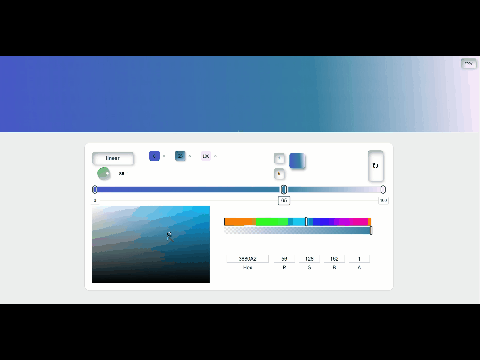
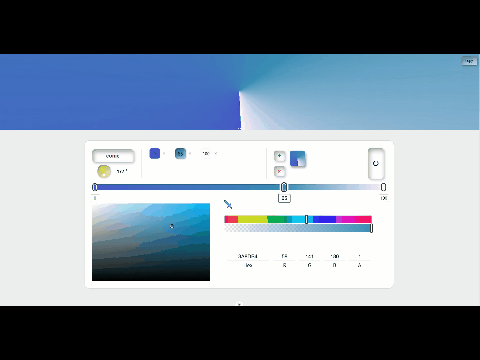
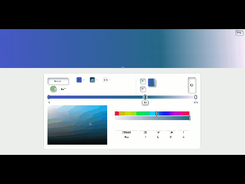
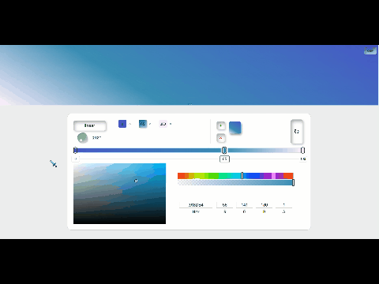
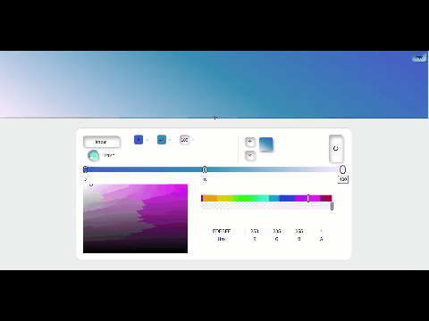
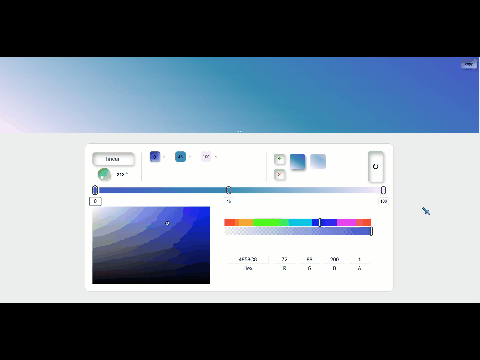

# 项目介绍

gradient-generator：一款可视化渐变生成工具，支持实时预览与CSS代码导出，帮助开发者快速创建线性/径向渐变效果。适用于网页设计、原型开发及设计系统集成场景，解决手动编写渐变代码效率低、预览不直观的问题。

## 核心功能
|功能|详情|
|:---:|------------------------------------------------------------|
|​实时预览|基于color的设置动态更新background属性|
|多渐变类型|支持线性渐变（轮盘拖动+角度输入）、径向渐变（圆形/椭圆）、锥形渐变（轮盘拖动+角度输入）| 
|​随机生成|预设模板+按概率生成美学渐变|  
|​一键复制代码|navigator.clipboard + 成功状态反馈|

## 功能演示
#### 动态更新渐变色

#### 颜色断点拖拽

#### 轮盘拖动+角度输入

#### 多渐变类型

#### 增删预设

#### 随机生成、一键复制

